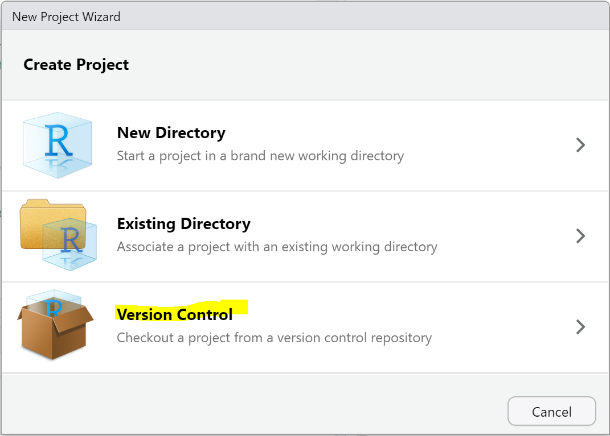
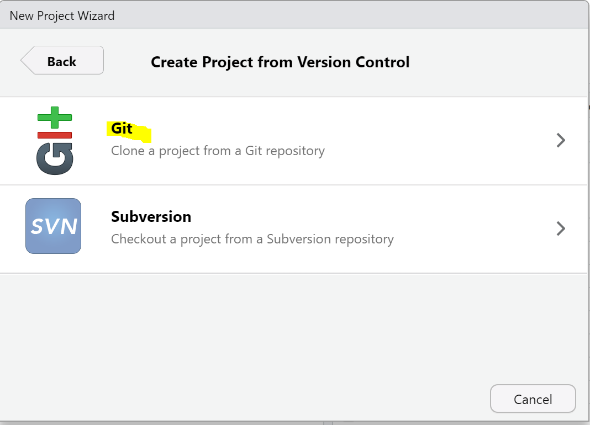
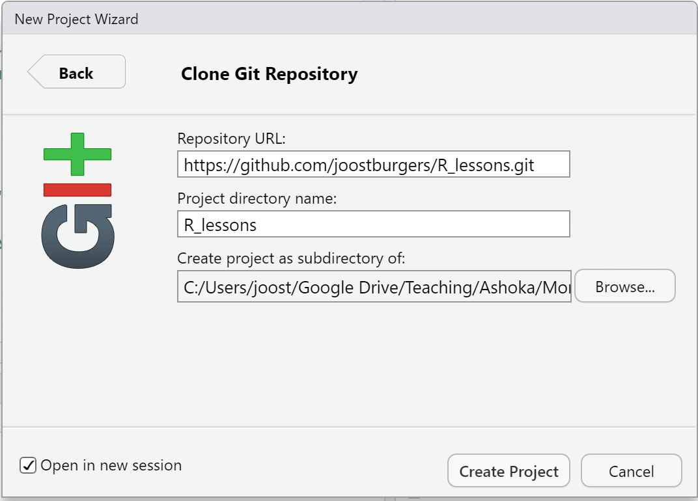

# R Lessons

## Introduction
This is a small repository of R markdown files created for the course *Introduction to Digital Humanities* at [Ashoka University](www.ashoka.edu.in). Students are expected to fork the repository and open the self-contained markdown file with the walkthrough. This repository will be updated to include more lesson plans in the future.
## Instructions

1. Open R Studio and go to file "New Project"**

2. Select version control:

3. Select git:

4. Fill in directory information and check "open in new session"

5. The R_lessons project file should open. If it does not go to the directory where it was saved and load it.
6. Open the first .rmd file in lesson_one_basic introduction.
