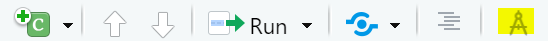
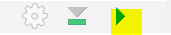
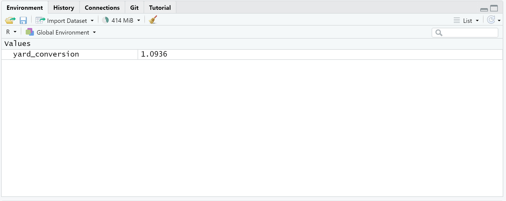
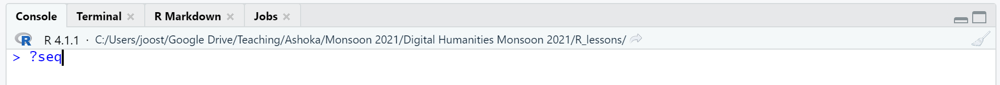
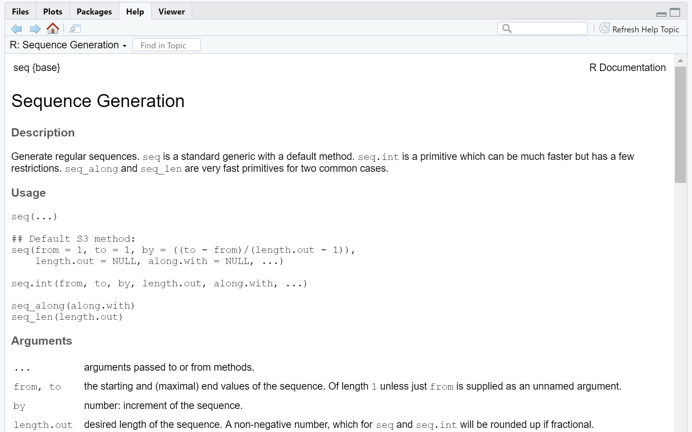

```{r setup, include=FALSE}
knitr::opts_chunk$set(echo = TRUE)
```

## Introduction

**Welcome to your first lesson in R!**

If you are reading this you've managed to find the Source Pane.

This is where we will be writing all of our code. You may notice that what you are reading is just text and not computer code. That's because this document is a special document called an R markdown document. Think of it as an interactive notebook that allows you to combine text and code. This way you can seamlessly write, code, and display your projects. As you'll come to learn, there is a huge advantage to this in terms of workflow. For example, if you have a data-driven essay, you will not have to go back to your word processor to manually enter the data. Instead, you can simply *knit* the document with the new data. If you are new to coding jumping right into markdown can be a bit daunting, because you are not only learning a new language, but also a very particular development interface. That said, learning to work in markdown documents early helps save a lot of time down the road. Your goal is to gather data, analyze it, write about it, and publish it. R markdown helps you accomplish all of these goals in one unified system.

## Markdown Documents

### Overview

Markdown documents can be broken up into two components the code and the information being displayed. The neat thing is that you can tailor your documents to your audience by only changing one or two settings, rather than manually creating an individual Word document for each. For example, let's say you used some fancy computational methods to infer that all of Shakespeare's work was, in fact, written by Francis Bacon (A nonsense theory that won't die!). You may want to think of the three different audiences this appeals to: the computer scientists who want to see your code and calculations, the literary scholars who want to know why you think this is the case, and a general public who just wants a slide show with pretty pictures. With markdown documents you can repackage the same information several different ways rather than having to write three different documents entirely.

### Navigation

In markdown you can create a heading by using a `#` where one `#` is the first level and each subsequent `#` is a level below. It's good practice to divide your work into headings, because it makes it easier to navigate between sections. You can do so by pulling up the document outline at the top right:

(Hover over the text "images/document_outline.png" to reveal the image)


### Styling

As the name indicates, R markdown uses Markdown as a language to style the document. This is really easy to learn and there's a nifty cheat sheet right here:

[R markdown cheat sheet](https://www.rstudio.com/wp-content/uploads/2015/02/rmarkdown-cheatsheet.pdf)

It takes about five minutes to learn the syntax. If you want to see what the document looks like you can also switch to the "visual markdown editor"



Now everything looks a lot cleaner, and *you* **can** ^see^ `the` ~~results~~. Avoid the temptation to work in the editor. It makes styling text easier, but occasionally it makes changes that you don't want. It's best to hard code the tags yourself.

### Coding

We can add code to the notebook by inserting a "code chunk." The first icon on the top right corner of this document should have a little pull down menu. 


By clicking on the first option you will get an R code chunk:

```{r}

```


A code chunk has several components.


You can run a code chunk by pressing the green play button at the top right of each individual chunk.



Click the green arrow on the chunk below.
```{r sample_plot}
#Note that this text in green is commented out. Anything with a hashtag in front of it will not run. This is useful for providing more details about the internals of the code. For example, for the plot below takes the data set cars and creates a scatterplot of speed versus distance, or, rather, acceleration of the cars.

plot(cars)
```


Note that clicking on the play button produced a plot. If you don't know how R did that, don't worry. The important part is that you know pressing the green button runs the code. 

## Basic Coding

### Basic Overview

Every programming language is essentially the same thing: a way for us to communicate with the computer to tell it what to do. Yet, as computers can do a whole lot of things, different languages have been developed that help achieve specific tasks. R was created with data science in mind. It is quick and powerful when it comes to dealing with data in tabular form, which are called data frames. R is not good for other tasks like creating video games or web apps. Thus, while some of the logic you may learn in R is generally applicable to other languages, most of the things you will learn concerns manipulating data frames ("wrangling data") and generating output ("visualization"). 

### Computer Science overview

The two useful things CS majors need to know.

* All math in R is vectorized. That is, every calculation is performed on an entire column of a table not just a specific cell value. This means no more writing `for` loops.

* Arrays start at 1 and not 0. This also means that index = array length. JS coders, no more writing array.length-1 for last value!

### Very basic coding

**If you have coded before you can skip this.**

Think of R as a fancy calculator with a lot of tricks and shortcuts

For example, if you type in any addition, in a code chunk it will give do the math for you.

```{r simple_math}
3+4
```

For me, R added 3+4 in a flash. Pretty sweet!


Admittedly, adding individual numbers, can be done through an actual calculator or even your brain. Sometimes though, you might want to reuse a specific number over and over again. For example, if you want to find out how many yards there are in a meter, you have to multiply meters*1.0936. Rather than typing 1.0936 every time we can simply turn it into a variable. In the example below we are assigning the number 1.0936 into a variable `yard_conversion` using the assignment operator `<-`. We can name the variable anything we want, say `fun_var_23`, but it is best to stay with something descriptive and short.

```{r yard_conversion}
yard_conversion <- 1.0936
```


You'll note that yard_conversion just appeared in the top-right "environment" window.


This is where R shows you the variables. For reasons that will become clear, this is very, very useful. 

Now let's math! Say we are taking a penalty in football and we're in the US, we'd have to measure in yards. We can make this calculation by using the conversion variable.

```{r penalty_kick}
11*yard_conversion
```
You should get 12.0296 yards. So far so good.

We can also use the variable for more complicated formulas. Let's say you want to know the area of a circle in yards, but you only know the radius is 23 meters. We can do that like so:

```{r area_circle}
pi*(23*yard_conversion)^2
```
 
That's pretty neat. Now, let's say you work for Circles International and you're constantly entering this formula. It gets pretty tedious. You want to be able to plug in the meters and get the result. To do this we can create a **function**. A function is a little piece of code that will take an input (variable/argument) and give (return) an output.

```{r AreaYards}
AreaYards <- function (meters) {
  return(pi * (meters * yard_conversion) ^ 2)
}
```

AreaYards is the name of the function. The blue word 'function' is a "reserved word" that is part of the syntax of R. Essentially, it tells R you want to create a function, much like the + operator tells it you want to add things. In the parentheses is the variable (argument) that you are going to put in. It can have any name, but obviously it is useful to name it something that gives an indication as to what it is. Between the curly brackets is the "guts" of the function. This is where you take the variable that was entered and perform an operation on it. It then returns the result of that operation.

Now that our function is made let's run it:

```{r AreaYards_sample}
AreaYards(23)
```
Sweet! Same answer

```{r}
AreaYards(15)
```

Note that when we change the argument of the function it produces a diffferent result. 

What makes R so powerful is that it has a lot of really useful functions for doing data science. In all likelihood you won't be writing any of your own functions, but borrowing what other people have already done. Base R has a lot of built in functions, but these can be expanded through "packages," bundles of functions that a good-Samaritan has created to make your life easier. We'll talk about this in a few.

For example, if you want to get the current time that's actually a pretty involved process, because you have to access the system time on the operating system. Fear not, there's function:


```{r system_date}
Sys.Date()
```

Note that even though we did not pass any variables to the function it still has the parentheses (). This is an easy way to identify functions. Tip: Sys.Date() and Sys.Time() are very useful for giving your output a time stamp.

Alternatively, you can also "nest" a function inside the parameters of another function. For example, the seq() function will generate a sequential list based on values.

```{r sequence}
seq(1:10) 
```

In R a numbers separated by a colon means a range of values.

```{r AreaYards_sequence}
AreaYards(seq(1:10))
```

I can keep nesting functions within each other.

```{r AreaYards_sequence_plot}
plot(AreaYards(seq(1:10)))
```

I can even pass multiple arguments in the same function.

```{r AreaYards_multiple_arguments}
AreaYards(seq(from = 5, to = 25, by= 5)) #Get the area yards of all circles from 5 meters to 25 meters by 5 meter increments
```

How did I know seq() can take multiple arguments? Use the help. Typing ? and the function name in the console will bring up the R help file (i.e. ?seq). 




Sometimes the language can be quite cryptic, but basically it tells you there are 5 arguments you can pass into the function. 


If you follow the argument order, you don't need to be explicit about the arguments.

```{r AreaYards_args}
AreaYards(seq(5,25,5))
```

I can nest even more

```{r AreaYards_max}
#Get the maximum value
max(AreaYards(seq(5,25, by=5))) 
```

```{r AreaYards_min}
#Get the minimum value
min(AreaYards(seq(5,25, by=5))) 
```

And nest what I've nested...

```{r AreaYards_mean}
#Make a vector of the min/max and then calculate the mean. There is no reason to do this.
mean(c(max(AreaYards(seq(5,25, by=5))),min(AreaYards(seq(5,25, by=5))))) 
```

Soooooo many parentheses. This becomes very confusing very quickly. Avoid this. Your code should be readable by others. This is called "literate programming," and for the purposes of academia it is extremely important. It means someone can step into your code and navigate it, even if they are not intimately familiar with the language. This is one key features of using programming for
academic research.

We can clean all this up.

```{r verbose_example}
circle_areas <- AreaYards(seq(5,25, by=5))
circle_areas_max <- max(circle_areas)
circle_areas_min <- min(circle_areas)
circle_areas_min_max <- c(circle_areas_min, circle_areas_max) #c(a,b,c...) concatenates values
circle_areas_mean <- mean(circle_areas_min_max)
circle_areas_mean
```

This code is a bit verbose. There's a lot of steps, and most of the are for creating intermediate variables that serve no purpose other than the final calculation. This happens a lot in R. So a fellow named Hadley Wickham came along and with a team of coders made the "tidyverse" package. This is a package used to do common data manipulations in R more efficiently. It is also a framework (dialect) of the R language meant to make it cleaner and more readable.

```{r tidy_example, eval=FALSE}
circle_areas <- AreaYards(seq(5, 25, 5))
circle_areas_mean2 <-  c(min(circle_areas),
                         max(circle_areas)) %>%
                       mean()
                
```

You notice the strange %>% (pipe) symbol. This basically means "and then." Thus, this line of code says concatenate the min and max values and then give the mean. With dplyr (part of tidyverse) you can pipe through a bunch of functions without reading them into variables or nesting them. It makes for clearer reading especially if you are piping through quite a number of
commands.

Now you'll note that if you try to run it it won't work. That's because you have not installed or loaded the package yet. But let's start on a clean page. Go to lesson 2 
