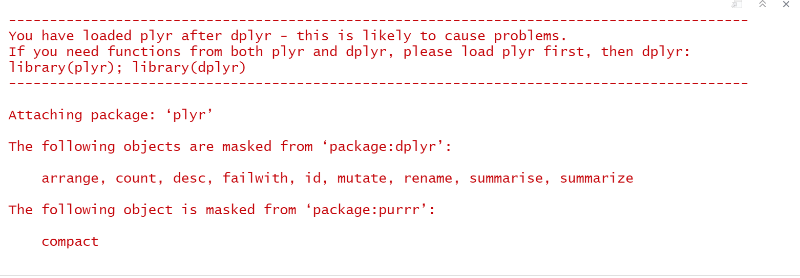

```{r setup, include=FALSE}
knitr::opts_chunk$set(echo = TRUE)
```


# Introduction

For this course, we will be working with the "tidyverse" suite of packages. These packages help unify and simplify the most common set of tasks you will be doing in data science: importing data, cleaning it up, transforming it, visualizing it, and sharing it with others. The image below gives a good overview of this workflow. It is not necessary to learn tidy to learn R, but it makes everything easier.


## Install packages

Much of the functionality in R comes from "packages." Packages are bundles of functions that will help you complete tasks more simply. Think of them as nice little shortcuts. You can install packages in two way: through Rstudio or console type `install.packages("tidyverse")` in the console. You can also go to Tools -> Install packages... for a more visual interface. Under the tab Packages you can also see what packages are installed. Rstudio pre-loads some of them. It is a good practice to update your packages regularly. Still, once a package is installed you will not need to install it again.


Note that sometimes updating packages might cause your code to stop working. This is because some functionality has become "deprecated." This is annoying, but it is usually good practice to keep your code as up to date as possible.

## Load packages

Once you have installed a package, you will still need to load it for your individual script. You will only need to do this once for each session. If your code stops working after you've restarted Rstudio, the most common error is that you have not actually loaded the library. Generally, you only want to load packages you are using. This is because packages can take a while to load, and because sometimes packages can conflict.


```{r load_packages}
library(tidyverse)
```

After loading a package, you might get a little report on what has happened. Usually, you can ignore this. Sometimes there might be conflicts and R will let you know. In the example below, I've loaded the `plyr` library after `dplyr`. As these packages share functions, R will get confused. 



## Import data sets

After you've loaded your libraries you generally want to work some data. R has some standard data sets that we can work with as examples.

```{r starwars_data}
data("starwars")
```

Assign data set to variable, not necessary but cleaner.

```{r assign_variable}
#In R the assignment operator is '<-'. It means put whatever is on the right into the thing on the left. In most other languages it is '='. In fact, '=' works in R as well. As you'll be writing <- a lot, remember that the shortcut key is alt+-.  

starwars_raw <- starwars
```

We can take a look inside the data by simply stating the variable name. The data is a table with some tidy secret sauce. This is technically called a `tibble`.

```{r see_data}
starwars_raw
```

## Modifying data

Unlike Excel where you tend to modify individual cells, the basic unit of manipulation in R is the column or vector. Rarely, do you want to manipulate individual values. Instead, you want to perform batch operations on your data. 

### Common procedures

#### Drop Not Available (NA) values

You might have a column that has NA values in it. Rather than deleting each individual row, you can just drop all of them.

```{r drop_na}
#The code here is saying: take the variable starwars_raw then ( %>% ) drop all of the na's in height. Assign all of that to a new variable starwars_no_na.
starwars_no_na <- starwars_raw %>% 
                  drop_na(height)
starwars_no_na
```
You'll see that all of the rows in which the height value was NA are now gone.

#### Add Column

You may want to add a column based on the values in another column. For example, mass indicates kilograms, but we might want to know pounds instead.

```{r add_pounds}
#The mutate function creates a new column based on the values you enter. In this case, we're saying create a new column called pounds that equals the value in mass times 2.20462. By default, the new column will appear to the far right of the table. 

starwars_tabulate <- starwars_raw %>% 
  mutate(pounds = mass*2.20462)
starwars_tabulate
```

We can of course be a bit more specific and clean things up.

```{r add_pounds_clean}
#Create a new column called pounds that equals mass*2.20462 rounded to 1 digit and place it after the column mass.
starwars_tabulate <- starwars_raw %>% 
                     mutate(pounds = round(mass*2.20462, digit=1), .after = mass) 
starwars_tabulate
```


### Coding Question
                      
The formula for converting centimeters to inches is 0.393701. Create a new column ("inches") next to the "height" column. Add it to the same table (starwars_tabulate). Delete the comment hashtags and fill in the BLANKS

```{r coding_question}
#starwars_tabulate <- starwars_tabulate %>% 
#                    mutate(BLANK = BLANK*BLANK, .after=BLANK)          
```

#### Select values

We can also use dplyr for easy selection of values. For example, we might want
to select only the humans in Star Wars.

```{r filter_example}
starwars_humans <- starwars_tabulate %>% 
                    filter(species == "Human")
#Note the double equal sign `==`. This is a comparison operator. It is looking at whether the thing on the left equals the thing on the right.
starwars_humans
```

We can run a filter on any number of columns. 


```{r multiple_filter}
starwars_humans_tall <- starwars_tabulate %>% 
                    filter(species == "Human" & height > 175) #All organisms where the species equals humans and (&) height is greater than (>) 175
starwars_humans_tall
```


#### Grouping values

Grouping variables is an important feature of data science. We might want to know the average height of feminine gender and masculine gender beings. We could create two variables (masculine_height and feminine_height) by filter out feminine in one and masculine in the other and then finding the mean. This is a lot of unnecessary steps. If we use the group_by() function, then R will see the different parts of the table as a group. We can then use summarize to run the same function on both groups.

```{r gender_height}
gender_heights <-  starwars_tabulate %>% 
                    drop_na(gender,height) %>% 
                    group_by(gender) %>% 
                    summarise(mean_height= mean(height))
gender_heights
```

Alternatively, we may want to group humans by gender and homeworld and then consider their height. 

```{r grouping}
starwars_humans <- starwars_tabulate %>% 
  filter(species == "Human") %>% 
  group_by(homeworld, gender) %>% 
  summarize(mean_height = mean(height))
starwars_humans
```


#### Combining multiple functions
  
We can keep piping through functions and things will remain fairly readable.

```{r height_gender_species}
# We want to figure out the relationship between the species, gender, and height.

height_gender_species <- starwars_raw %>% 
  drop_na(height, species) %>%  #drop all rows where height or species are not known.
  group_by(gender, species) %>% #group by gender and species
  summarise(mean_height = mean(height), total = n()) %>% #calculate the mean per group and the                                                             total number per group.
  arrange(desc(total)) %>% #arrange the table in descending order based on the total.
  filter(total >= 2) %>% #Filter out every species for which there are at least two (>=) organisms. 
  select(species, gender, total, mean_height) #select only the species, gender, total and mean_height columns
height_gender_species
```
  
#### Combining and plotting

We can even create a variable and then plot it directly

```{r combined_plot}
starwars_raw %>% 
  drop_na(height, species) %>% #drop all rows without height or species value
  group_by(species) %>% #group by species
  summarise(mean_height = mean(height), total = n()) %>% #get average height of each species, count the total number of species.
  filter(total > 1) %>% #only grab values where the total number of species is more than 1.
  ggplot(aes(x= reorder(species,mean_height), mean_height))+ #Make a plot with species sorted by height on the x axis, and mean_height on the y axis.
  geom_col() + #Make it a column chart
  labs(title = "Height by Species", #label the title, x , and y axis.
       x = "Species",
       y = "Mean Height")+
    theme_light() #Set the theme to light
```

Star Wars fans might gasp and think this chart is wrong. Wookiee's are small, but remember Chewbacca is also a Wookie.  


