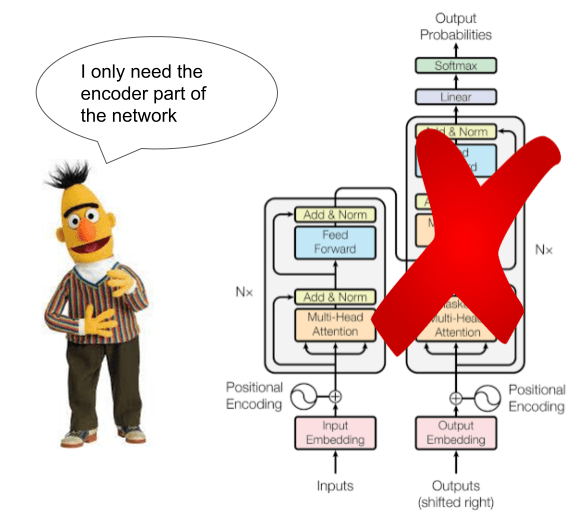

## Introduction

As the name suggests, Natural Language Processing, is a field of study that develops and implements techniques that allow computers to "read" text. While the sentiment analysis we did can provide interesting global insights, it only understood specific words in the text as being charged with certain sentiments, and could not be used to analyze text at a more complex level. Indeed, one thing to realize is that books are not only bags of words, but are complex structures hierarchized through sentences. Thus, in order to "read" a computer needs to know something about word domains and their order within a sentence, so as to infer a possible meaning. 

For example: 

- I walked to a branch **of** the bank to make a deposit.
- I walked to the fallen branch **on** the bank of the river.

In both cases, the word branch is a noun, but they signify quite different things. The first is a local operation division of a larger business, and the second is part of a tree. In both cases, the word bank changes meaning as well. The first is a financial institution, the second is where land meets water. Human readers can pick up on these distinctions no problem. Suffice to say, that this is much harder for computers. It would have to know that the bold words are prepositions and that they change the meaning of the noun phrase "branch _ the bank."

Without going into the weeds too much, the early days of NLP used statistical inference to determine dependencies between words by scouring large data sets. Human supervision was then required to identify what these dependencies meant. This process was iterated and refined, until the language models acquired a basic understanding of the parts-of-speech in a sentence (verb, noun, preposition, etc). These were then further refined to understand word types on a semantic level. London and Jack London are both nouns, but one is a location and another is a person. If you simply had a dictionary of different nouns it would be hard for a computer to make this distinction, but if you know something about the grammar of a sentence this becomes easier. 

- The weather in London was cold and foggy.
- Jack London wrote *Call of the Wild*.

In the former, a computer can identify London as a location because the preposition **in** signals a preposition of location. In theory, the computer should be able figure extract London and identify it as a location, and extract Jack London and identify it as a person. The process of identify locations, dates, organizations, people and other semantic level information from a text is called Named Entity Recognition. For the study of literature this process is very useful, because it let's you know some of the important things inside a text, more than just a bag of words. 

Note that the extraction above is purely theoretical. Traditional NER libraries still have a hard time make distinctions between entities, especially with fiction. There are more advanced techniques like BERT, but there are currently no easy-to-use implementations in R. In fact, the best library for this is actually CleanNLP, which uses Python's `spaCy` library. Unfortunately, there are currently issues with the R implementation of this library. We are using a more rudimentary library called openNLP that is slower and less precise. It is a a taste of things that might be possible with NER.



## Part 1: Setting up NER

R does not have a "native" NLP library therefore you need to setup a "pipeline" to a library in another language Python - spaCy or Java - Apache. In both cases the process is annoying, and spaCy does not even work in R at the moment. 

### Installing Java
The openNLP library works with a Java backend. In order to use this, you need to install Java on your machine. Full instructions are here:

[Instructions]("Java_Instructions.docx")

Now, install the following libraries: 

```{r error=FALSE, eval= FALSE, warning=FALSE, message=FALSE}
install.packages("rJava")
install.packages("openNLP")
install.packages("NLP")
```

Now you will need to download the NLP models for your analysis. You will only need to do this step once.

```{r echo=TRUE, eval= FALSE, error=FALSE, warning=FALSE, message=FALSE}
install.packages("openNLPmodels.en", dependencies=TRUE, repos = "http://datacube.wu.ac.at/")
```

Now load the NLP packages and the Tidy low-calorie special sauce. There's an extra library here, `textclean`, that we'll use for some basic text cleaning.

```{r echo=TRUE, results='hide', message=FALSE}
#NLP Libraries
library(rJava)
library(openNLP)
library(NLP)


#Tidy data manipulation
library(stringr)
library(dplyr)
library(tidyr)
library(tidytext)
library(readr)
library(stringi)
library(textclean)

#Corpus ingest
library(gutenbergr)

#Helper library
library(sqldf)

#Graphics library
library(ggiraphExtra)
library(ggplot2)
library(RColorBrewer)
library(scales)
```

## Part 2: Getting Started: Ingest

#### Read the data with GutenbergR

As per usual, we'll fetch a corpus. Let's go with something rich in characters and locations: 

- *Great Expectations*
- *A Tale of Two Cities*

```{r}
corpus <-
  gutenberg_download(c(1400, 98),
                     mirror = "http://mirrors.xmission.com/gutenberg/",
                     meta_fields = c("author", "title"))
```


#### Clean the data

This is usually the most laborious part of NLP. In order to process the data there can be no special or strange characters. We'll note that if we search for "_" in the corpus, a number of words like `_John_` come up. This is not useful. Presumably there are other errors in these texts. You will have to got through and do manual searches to figure out what might be awry. This is by far the most time intensive part of any analysis. Your results are only as good as your data.

```{r pre_clean_corpus}
corpus_clean <- corpus %>%
  filter(text != "") %>%
  mutate(text = str_replace_all(text, "_", " ")) %>%
  mutate(text = replace_contraction(text)) %>%
  mutate(text = replace_curly_quote(text))
```

## Part 3: Running NER

### Priming for NLP

We now have to prime the data for our NLP pipeline. The package does not like working with tables, therefore we have to feed all of the text into a **String** - a special data type in the NLP library. Still, as we want to retain the book titles we need to make some modifications. We first want to collapse all the text into one cell by book. Then we want to convert that cell to a list that will hold the String object

#### Collapse text column

```{r create_strings}
corpus_text <- corpus_clean %>%
  group_by(title) %>%
  mutate(text = paste(as.character(text), collapse = " ")) %>%
  distinct() %>%
  ungroup()
```

#### Convert to nested String object

```{r create_nested_string}
corpus_text_str <- corpus_text %>%
  group_by(title) %>%
  mutate(text = list(as.String(text)))
```

### Set the NLP pipeline

Since we have to use a particular language model to do the analysis, we have to create a pipeline to that model. OpenNLP has a couple of functions that do this for us. We want to annotate words, sentences, and finally based on that knowledge, entities within the text. The following commands load all of these models into memory.

```{r initiate_pipeline}
#set pipeline
wordAnnotator <- Maxent_Word_Token_Annotator(language = "en")
sentenceAnnotator <- Maxent_Sent_Token_Annotator(language = "en")
characterAnnotatorEN <- Maxent_Entity_Annotator(language = "en", kind = "person")
locationAnnotatorEN <- Maxent_Entity_Annotator(language = "en", kind = "location")

pipeline <- list(sentenceAnnotator,
                 wordAnnotator,
                 characterAnnotatorEN,
                 locationAnnotatorEN)
```

### Initiating the process

#### Chunking and extracting entities

>The following procedure will take a while

NER with openNLP is a pretty intense and, I suspect, inefficient process. Part of the issue is that if you have a particularly large data set the amount of memory it takes up will balloon quite rapidly. This will crash everything. To avoid this, I've written a custom script to "chunk" the data into smaller pieces, run the NER function, and then piece it all together. What's more, since the tokenizer wants the information in a particular way, we have to preserve our metadata. This also requires us to decompose and recompose our data frame.

We could create a function for this, or just run this as a double `for` loop in which the loop runs through each `title` in the data frame and chunks it up into different sections and returns the extracted entities with the title and author in tact. **Note that this procedure takes a long time to run**. Make sure you have the corpus you want.

There are a couple of variables you can change to switch up how the processing goes. If the corpus is too large to process, set `chunk_size = 100000` to a smaller number. If you modified your corpus and added variables such as `gender`,`nationality`,`race`, this process will drop those features. You have to modify the line: `mutate(author = corpus_text_str$author[j], title = corpus_text_str$title[j])`. Simply, add the name of your column and the location in the original dataframe and it should add. i.e. `mutate(author = corpus_text_str$author[j], title = corpus_text_str$title[j], gender = corpus_text_str$gender[j] )`.  

```{r NER_chunker, message=FALSE}
#create empty df
full_df = as.data.frame(NULL)
chunk_size = 10000

for (j in 1:nrow(corpus_text_str)) {
  #get number of chunks
  chunk <- nchar(corpus_text_str$text[j]) %/% chunk_size
  text <- unlist(corpus_text_str$text[j])
  text <- as.String(text)
  
  #Loop runs through the text section by section and reads each chunk into a df
  
  for (i in 1:chunk) {
    print(paste0(
      "Processing title: ",
      corpus_text_str$title[j],
      " - section ",
      i,
      " of ",
      chunk
    ))
    temp_df = NULL
    
    if (i == 1) {
      m = 1
    }
    
    if (i == chunk) {
      m = n + 1
      n = (nchar(text))
    }
    else{
      n <- m + chunk_size
    }
    
    temp_string = text[m, n]
    
    temp_ann <- NLP::annotate(temp_string, pipeline)
    
    temp_df <-  temp_ann %>%
      as.data.frame %>% 
      filter(type != "word")
    
    temp_df <- temp_df %>%
      mutate(words = str_sub(
        as.character(temp_string),
        start = temp_df$start,
        end = temp_df$end
      )) %>%
      unnest_wider(features)
    
    temp_df <- temp_df %>%
      mutate(author = corpus_text_str$author[j], title = corpus_text_str$title[j]) 
      #This is where you would include your added variable
      
    
    #stitch it all together
    full_df <- full_df %>%
      bind_rows(temp_df)
    
    m <- m + chunk_size
  }
}

```

#### Create backup variable

When you run through a particularly tedious process, save the output as a backup variable. You can delete this when you are done, but you don't want to manipulate data without being able to recover it if you mess up.


```{r create_backup}
full_df_backup <- full_df
```


#### Rough clean the output

Every corpus you work with is going to have particular artifacts. The more varied your corpus, the higher the likelihood of margin cases - special exceptions. The only way to know what inconsistencies there are in the data is by looking at it. At this juncture, I know that the annotator screwed up some of the names by leaving in the punctuation. **Tom! Tom? and Tom** are all the same person. We can scrub this by removing all punctuation from the retrieved entities list.


```{r rough_clean}
full_df <-  full_df %>%
  mutate(words = str_remove_all(words, '[:punct:]'))
```

#### Realigning the columns

Right now, the author and title columns are all the way on the right. This feels unnatural. We can move them around with the `relocate()` function. We'll also drop some columns that aren't useful and take up space.

```{r reshape_df}
full_df <- full_df %>%
  relocate(c("author", "title"), .before = 1) %>%
  select(-id,-constituents) 
```

#### Backup processed data

Now that you have processed some of the initial data it is a good idea to back it up. You don't want to have to rerun all these procedures.

```{r backup_annotations, results='hide'}
write_csv(full_df, "annotation_backup.csv") 
```


##### (Optional) Restore data

If you want to restore the extracted entities uncomment and run the line below.

```{r}
#full_df <- read_csv("annotation_backup.csv")
```

## Part 4: Cleaning the Text (Again)

#### Appending locations in each sentence

Now that you have annotated the text, the "entities" are all part of the df. 

We'll note that the entities are "below," and that the sentences are "above". What we want to do is join the bottom part with the top part. There is no way to do this without first splitting up the table. Let's create two tables, one with sentences and one with entities.

```{r split_sentence_entity}
df1 <- full_df %>%
  filter(type == "sentence") %>%
  mutate(sentence_nr = row_number()) %>%
  select(author, title, words, sentence_nr) %>%
  rename(sentence = words)

df2 <-  full_df %>%
  filter(type == "entity") %>%
  mutate(record = row_number()) %>%
  select(words, kind)
```

#### Thoroughly clean the entities

You can also catch these entities further downstream, but there is no need to wait. Cleaning them now, will make processing go faster. You want to delete everything that is not obviously a location or a character. Pay attention to words like "The, A, Then, There, Them, We, I, etc.." These will bring the process to a crawl. Eliminate anything that is not a proper noun. Do not start fixing character names yet.

```{r computational_cleaning}
df2 <- df2 %>%
  mutate(words = str_replace_all(words, "Dear ", "")) %>%
  mutate(words = str_replace_all(words, "Young ", "")) %>%
  mutate(words = str_replace_all(words, "Ah", "")) %>%
  mutate(words = str_replace_all(words, "Oh", "")) %>%
  mutate(words = str_trim(words, side = "both")) %>%
  mutate(words = str_trim(gsub("[A-Z]{2,}", "", words))) %>%
  mutate(words = str_squish(words)) %>%
  mutate_all( ~ ifelse(. %in% c("N/A", "null", ""), NA, .)) %>%
  drop_na() %>%
  dplyr::filter(nchar(words) > 2) %>%
  distinct()

capital_stopwords <-
  as.data.frame(str_to_title(stop_words$word)) %>%
  rename(words = 1)

df2 <- df2 %>%
  anti_join(capital_stopwords)
```

#### Manual cleaning

Create a csv file and manually take out the bad hits.

```{r backup_join}
write_csv(df2, "pre_join_entities.csv")
```


#### Joining the two sections

Now that we have two separate tables we can rejoin them. Still, we can't just join them by "word" that won't work. How can we go about rejoining these two tables? We can place the *entities* in *sentences* based on whether the word is detected in the sentence. This function takes a long time depending on how many entities you have. 

Load the manually cleaned CSV file.

```{r load_cleaned_data}
#Prep the data
pre_join <- read_csv("pre_join_entities_clean.csv", na = "NA")
```


#### Limit join words

Since we are only looking to identify the word with the entity, we want to make sure we don't have duplicate words as this will repeat the process unnecessarily.

```{r limit_join_words}
pre_join <- pre_join %>%
  select(words, kind) %>%
  drop_na()  %>%
  distinct()
```

We can join the two tables using an SQL query.

```{r match_dataframes}
#Execute a SQL query
full_join_df <- sqldf("SELECT *
      FROM df1
      LEFT JOIN pre_join ON df1.sentence LIKE '%' || pre_join.words || '%'")

full_join_df <- full_join_df %>%
  distinct()
```

After all that we finally have a table with all of the words tagged by entity type.

## Part 5: Sentiment analysis

While sentiment analysis and NER are both interesting analysis by themselves, what makes using computational methods so powerful is combining, iterating, and modeling your data sets to get a better sense of what is inside. For example, now that we have our named entities, we can think about the emotional valence of those entities by combining our sentiment tables with our NER tables. 

#### Clean up entities

Our table is pretty clean right now. We have sentiment per sentence and the entities located in those sentences. The problem is that that the entities are actually a bit distorted. Some are actually duplicates, some are not entities at all. Before we make the final tally, we have to manually scrub the data set. This is time consuming and there are diminishing returns. Scrubbing out one or two bad entries does not make much of a difference, but matching a partial first name with a full name can really help improve the count. The easiest way to do this is to export it to a csv and use Excel.

The visualizations below will only be as accurate as the data you put. Interestingly, not cleaning up the files gives Joe from *Great Expectations* a negative sentiment while the clean version gives him a *positive* sentiment. That's pretty important.

```{r}
write_csv(full_join_df, "entities_raw.csv")
```

This step is extremely tedious. Essentially, you open the doc in Excel and put on a filter. Then you search for a word that looks like it might have multiple words attached to it in the filter. Change all the names to say the same thing and make sure it is a location or person consistently, and then repeat.

```{r}
clean_entities <- read.csv("entities_cleaned.csv")
```


#### Unnest sentences

We can now unnest sentences, and get a view of the words that "surround" the entities. 

```{r unnest}
entities_unnest <- clean_entities %>%
  unnest_tokens(word, sentence)
```

#### Drop Stopwords

```{r remove_stopwords}
entities_unnest <- entities_unnest %>%
  anti_join(stop_words)
```

#### Peel off the sentiments

We can run our "nrc" sentiment analysis and attach several columns of values to this table.
First, create a separate table of sentiments by sentence.

```{r message=FALSE}
#create sentiment table
entities_sentiment <- entities_unnest %>%
  group_by(author, title) %>%
  inner_join(get_sentiments("nrc")) %>%
  count(sentence_nr, sentiment) %>%
  spread(sentiment, n, fill = 0) %>%
  mutate(sentiment = positive - negative)
```

#### Stick them back on

Now recombine the columns of sentiments with the original entities, and drop the repeat values.

```{r message=FALSE}
entities_matches_sentiment <- entities_unnest %>%
  inner_join(entities_sentiment) %>%
  distinct_at(vars(-word))  
```

#### Final tally

Sum the table by total sentiment for author, title, and words.

```{r message=FALSE}
ner_total_sentiment <- entities_matches_sentiment %>%
  group_by(author, title, words, kind) %>%
  summarise(total = mean(sentiment))  
```

## Part 6: Visualization

Now that we have the data we can actually visualize it. 

#### Chart of the top 10 

We can chart the top 10 characters based on their positive sentiment. Note that the characters may or may not be positive. This is merely describing their context.

```{r message=FALSE}
ner_total_sentiment %>%
  group_by(title) %>%
  filter(kind == "person") %>%
  top_n(10) %>%
  mutate(words = reorder(words, total)) %>%
  ggplot(aes(words, y = total, fill = title)) +
  geom_col() +
  facet_wrap(~ title, scales = "free") +
  coord_flip()
```
#### Chart bottom 10

We can also map out the bottom ten by reversing the top_n to a negative number top_n(-10).

```{r message=FALSE}
ner_total_sentiment %>%
  group_by(title) %>%
  filter(kind == "person") %>%
  top_n(-10) %>%
  mutate(words = reorder(words, (desc(total)))) %>%
  ggplot(aes(words, y = total, fill = title)) +
  geom_col() +
  facet_wrap(~ title, scales = "free") +
  coord_flip()
```


### Individual sentiments

The variable `entities_matches_sentiment` also houses the other NRC emotions. We can put these individual emotions on a radar plot. 

Note that this table still contains the values positive, negative, and sentiment. It is useful to keep these around for a bit, just so we can sort out what we want to look at.

#### Ranking by "total" emotion

There is no way to intelligible map over 100 entities. You want to break them down in some meaningful way. One way to look at it is by raw character prominence. That is, who is the character the most surrounded by the most emotion words. The function below does just that.

```{r radar_plot_total, message=FALSE}
radar_facet <- entities_matches_sentiment %>%
  select(-positive, -negative, -sentiment) %>% #drop out the unnecessary columns
  filter(kind == "person") %>%
  group_by(title, words, kind) %>%
  summarise(across(anger:trust, sum)) %>%
  mutate(total = rowSums(across(where(is.numeric))))  %>%
  arrange(desc(total)) %>%
  head(5)  %>% #Change number to include more or fewer entities
  mutate(across(anger:trust, .fns = ~ round((. / total) * 100))) %>%
  select(-total,-kind)

ggRadar(
  data = radar_facet,
  mapping = aes(color = title, facet = words),
  rescale = FALSE,
  interactive = TRUE,
  use.label = TRUE,
  size = 2,
  legend.position = "right"
)
```


#### Radar plot by the highest positive or negative emotion

We can also map the emotions by looking at the largest positive and negative sentiment. To switch from positive to negative, simply change `head(5)` to `tail(5)`. This means that instead of grabbing the top of the table we are grabbing the bottom. Since the table is organized in descending order, we'll get the lowest values based on `sentiment`. 


```{r message=FALSE}
radar_facet_sentiment <- entities_matches_sentiment %>%
  #Change filter to locations for locations
  filter(kind == "person") %>%
  group_by(title, words, kind) %>%
  summarise(across(anger:sentiment, sum)) %>%
  arrange(desc(sentiment))  %>%
  tail(5)  %>% #Change number to include more or fewer entities
  select(-positive, -negative, -sentiment, -kind)

ggRadar(
  data = radar_facet_sentiment,
  mapping = aes(color = title, facet = words),
  rescale = FALSE,
  interactive = TRUE,
  use.label = TRUE,
  size = 2,
  legend.position = "right"
)
```
